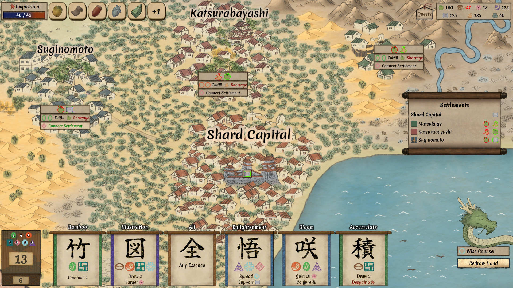

# Worlds Upon The Wind

[](https://store.steampowered.com/app/3640430/Worlds_Upon_The_Wind/)
[
[](http://creativecommons.org/publicdomain/zero/1.0/)

This is the public domain release of **Worlds Upon The Wind**, a peaceful roguelite deckbuilder [available on Steam](https://store.steampowered.com/app/3640430/Worlds_Upon_The_Wind/).



Worlds Upon The Wind is a peaceful roguelite deckbuilder where you resettle the shards of a shattered world. Its art is based on public domain historical Japanese art, mainly ukiyo-e woodblock prints and e-maki (picture scrolls).

The game has a 20-30 hour long campaign, as well as hundreds of glyphs (cards), relics, events, and other content. It also includes an extensive art wiki of hundreds of public domain woodblock prints and scrolls, and integrated Japanese practice minigames with thousands of vocabulary entries and annotated example sentences. It is available on Windows, Linux, and MacOS. As of Sep 2026, it has a 99% positive rating on Steam.

The primary goal of this repository is to provide a complete, production-tested reference for other indie developers.

## What's Included

* The complete Godot project and all source code, mainly GDScript.
* A small C++ GDExtension for efficient map generation and sprite management.
* Full source art assets (PSD, SVG).
* Automated scripts for building and publishing to Steam on all platforms.
* Steam achievement integration.
* A localization plugin that handles exporting strings from Resource instances and arbitrary Nodes within scenes.
* Scripts to tag and annotate Japanese text.

**IMPORTANT: AUDIO EXCLUDED**

Due to third-party licensing restrictions, **all music and sound effects are excluded**. When running the game from this repository, it will play silently except for voiced cutscenes.

## Running the Project

The project can be edited on Windows, Linux, or MacOS.

1. Install [Godot 4.7](https://godotengine.org/download/archive/4.7-stable/).
2. Clone this repository:
   ```bash
   git clone https://github.com/max99x/wutw-public
   ```
3. From the Godot Project Manager, click **Import** and select `wutw-public/wutw/project.godot`.
4. If you see console errors, wait until all data is imported and reopen the project.
5. Press `F5` to run the project.


## Project Architecture

The game is made in Godot 4 and uses GDScript for the majority of its logic. A few performance-critical parts, such as the map generator, are written in C++ as a GDExtension. Most of the visuals use Godot's standard GLSL shaders. Some automation code is in Bash and Python. The game makes heavy use of Resource subclasses for all game elements such as cards, relics, skills, characters, quests, linkable gameplay terms, and many more.

The code is intentionally kept as simple as possible while supporting efficient content creation and being robust enough for a commercial release. Here's an overview of what's included:

* Scripts in the root folder handle building the game on all platforms and publishing it to Steam.
* `art_src`: Source files for art assets. Mostly PSDs, plus a few Inkscape SVGs.
  * `sprites`: This contains giant PSDs with hundreds of layers for the map sprite atlasses.
* `wutw-gdext`: The C++ GDExtension for generating and managing the game's map, including creating biome SDFs and managing sprites for both cosmetic and gameplay objects as a MultiMeshInstance2D. A simple build script is included which will put the binaries in the right place within the Godot project.
* `wutw`: The Godot project, split roughly by system:
  * `main.tscn`: A tiny main scene, which mainly manages the switching between core scenes like MainMenu, Hub, and Run.
  * `res://achievements/`: Steam achievements implementation.
  * `res://addons/`: Several small addons, some third-party, some custom.
    * `console` is a third-party addon that adds a customizable ingame debug console.
    * `godotsteam` is a third-party addon for Steam integration.
    * `godot_resource_groups` is a third-party addon for defining sets of Resources using path patterns. The loading aspect of it is unused.
    * `wutw_editor` adds an editor dock to start the game from various story points and with various progression states.
    * `wutw_exporter` embeds the git commit and tag to when exporting the game for distribution.
    * `wutw_i18n_export` exports strings for localization from Resource instances and Nodes embedded in scenes.
  * `res://art/`: The art wiki, including the UI and all data for the various historical and original art pieces, artists, art styles, etc.
  * `res://aspects`: The Essences and Slots system which is the core mechanic of the game.
  * `res://audio`: A simple Wwise-based audio system that handles SFX, music, and ambient audio. The audio files themselves are not included due to licensing restrictions, so it is essentially a no-op at runtime, but all the code is there.
  * `res://bin`: Windows, Linux, and MacOS binaries for the GDExtension in `wutw-gdext`.
  * `res://bonuses`: The Yields system, which comprises the main resource the player gathers.
  * `res://cards`: The Glyphs system, which are the cards that the player plays. Includes all related UI scenes, scripts for the invocations (card abilities), and the definition of all the cards in the game as individual Resources.
  * `res://characters`: The Characters system, which includes story characters and randomized Haven (hub area) characters.
  * `res://companions`: The Animal Companions system, including gameplay and hub support.
  * `res://cutscenes`: The game's fullscreen cutscenes including their Scenes, art, and voice audio.
  * `res://debate`: A small system for handling the Debate feature that takes place in the game's final section.
  * `res://dialogue`: A simple dialogue system, including support for playing dialogues during runs (expeditions) and on the hub, as well as barks (semi-random one-liners for hub NPCs). This doesn't handle any player choices.
  * `res://events`: The Events (interactive vignettes) system, as well as the definition of all events in the game as individual Resources.
  * `res://glossary`: A system for linkable gameplay terms used throughout the game to show tooltips and various gameplay-related text. This folder includes "standalone" terms, and many other parts of the game (cards, relics, etc.) are themselves Terms.
  * `res://hub`: The game's hub area system, including all the related UIs (museum, skills, crafting, shard cultures, etc.).
  * `res://i18n`: The exported dump of all localizable strings from the game.
  * `res://japanese`: Code related to the Japanese learning part of the game. This includes the minigames, but also third-party linguistic databases and editor tools to extract and convert relevant parts of them into Godot resources.
  * `res://main_menu`: The main menu UI.
  * `res://map`: The Map system for displaying and manipulating the ingame map. Includes resources defining all the sprites used on the map in a custom format and a giant shader to render them all in one pass.
  * `res://pause_menu`: The pause menu UI.
  * `res://quests`: The Quests system, including both main story quests and repeatable settler quests. This is probably the jankiest part of the codebase.
  * `res://relics`: The Relics system, including the definition of all the relics in the game, one resource and one script per relic.
  * `res://run`: The Run system, which manages the state of a single run (expedition).
    * `run.gd` is the backbone controlling most of the high level gameplay state during a run.
    * `run_data.gd` represents the persistent state of the run.
    * `run_signals.gd` acts as a signal bus used by many other systems.
  * `res://settings`: The settings menu and a GameSettings singleton for loading and querying game settings.
  * `res://shard_types`: The Shard Cultures system, including the definitions of each culture, one resource and one script each.
  * `res://shops`: The Landmarks system, including the definitions of each landmark, one resource, one scene, and one script each.
  * `res://skills`: The Skills system, including the definitions of each skills as resources. Skills don't have behavior themselves - they are just data queried by other systems.
  * `res://stage`: The core card gameplay system.
    * `stage.gd` handles gameplay during forays, surveys, and convergences. 90% of the time spent in the game involves the player interacting with it.
    * `hauntings` is the Hauntings feature, including the definition of all hauntings.
    * `spots` is the Sites system that defines the different biomes and terrain features and their developments as resources.
    * `survey` implements survey gameplay and contains the definition of all survey encounters.
    * `selector` handles selecting stage locations on the map between stages.
  * `res://startup`: A janky system for preloading resources, because the built-in Godot resource loader is extremely buggy as of 4.7.
  * `res://theme`: Reusable UI primitives like buttons, panels, and drop-downs.
  * `res://tutorial`: The Tutorials system, including all the contextual tutorials, one script each, and the starting tutorial at the beginning of the game.
  * `res://utils`: Low level utilities.
    * `save_game.gd` is the most important file here. It handles saving and loading, but more importantly, it serves as the persistent source of truth for game state which all other systems read from and write to.
    * `utils.gd` has a bunch of common utility functions used in almost every other script.
    * `random_state.gd` is a deterministic seeded random generator used throughout the game.
    * `bug_reporter` is a simple UI for sending feedback reports from within the game. It bundles the logs, the savegame, and a screenshot and sends them off via HTTP POST to a server (which just forwards it as an email).
  * `res://visuals`: A few reusable art assets and scenes, such as shader includes and transition scenes.
  * `res://_dev_tools/`: Editor scripts and scenes for more efficiently creating content such as new cards, events, and encounters. Also includes scenes that generate Steam screenshots and trailer segments.

## Contributing

This is a read-only mirror, so I am unable to merge pull requests. However, I am open to manually accepting significant contributions.

Additionally, while the game is set up for localization, it is not currently localized due to the sheer amount of text (230k+ words, 800+ pages, though about a third is Japanese learning materials). If you are interested in contributing to translation, let me know.

## Maintenance

This mirror is updated along with the official Steam release.

## License

Except for third-party data mentioned below, and the excluded audio, the entire game is released into the public domain. Feel free to reuse any art and code, including within commercial projects.

You are even welcome to translate and sell the game without any royalties, though attribution is appreciated.

## Third Party Licenses

- [Godot](https://godotengine.org/) engine: MIT License.
- [GodotSteam](https://codeberg.org/godotsteam/godotsteam/) addon: MIT License.
- [Godot Resource Groups](https://github.com/derkork/godot-resource-groups) addon: MIT License.
- [godot-console](https://github.com/jitspoe/godot-console) addon: MIT License.
- [Yuji Mai](https://fonts.google.com/specimen/Yuji+Mai), [Merienda](https://fonts.google.com/specimen/Merienda?preview.script=Latn), and [Noto](https://fonts.google.com/noto) fonts: SIL Open Font License.
- [KANJIDIC2](https://www.edrdg.org/wiki/index.php/KANJIDIC_Project) dictionary: CC-BY-SA 4.0 License.
- [JMdict](https://www.edrdg.org/edrdg/licence.html) dictionary: CC-BY-SA 4.0 License.
- [JMdict-simplified](https://github.com/scriptin/jmdict-simplified) dictionary: CC-BY-SA 4.0 License.
- [tatoeba.org](https://tatoeba.org) example sentences: CC-BY 2.0 FR License.
- [KanjiVG](https://kanjivg.tagaini.net/) stroke data: CC BY-SA 3.0 License.
